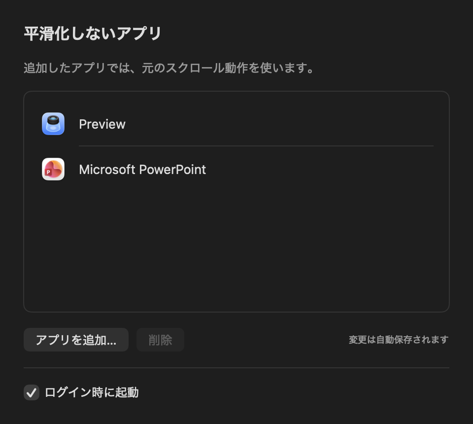

<p align="center">
  
</p>

# SmoothScroll

一般的なマウスやトラックボールのホイール操作を、Macで滑らかにするメニューバーアプリです。

ホイールの段階的な入力を小さなスクロールに分割し、縦にも横にも滑らかに動かします。ページ送りなど、元の操作感を残したいアプリは対象から除外できます。

- **縦横のスクロールを平滑化**：位相情報を持つトラックパッドなどの入力は、そのまま通します。
- **アプリごとに除外**：設定画面で追加、削除でき、変更はすぐに反映されます。
- **メニューバーに常駐**：Dockには表示されません。ログイン時の起動も選べます。

<p align="center">
  
</p>

## 動作環境

- 動作確認済み：Apple Silicon搭載Mac、macOS 26.6.2
- ビルドに必要なもの：SwiftコンパイラとmacOS SDKを含むXcode Command Line Tools、またはXcode
- 利用に必要な権限：アクセシビリティ

現在のビルド手順は、ビルドしたMacの環境を対象にします。Intel Macや他のmacOSバージョンでの動作は未検証です。管理された端末では、組織が認める範囲でアプリを導入し、権限を設定してください。

## インストール

ソースからビルドして使用します。以下はリポジトリのルートで実行してください。

### 1. ビルドする

署名証明書がない場合は、一時署名を指定します。

```sh
make app SIGN_IDENTITY=-
```

リポジトリ直下に `SmoothScroll.app` が生成されます。

> 一時署名では、アプリの更新後に権限の再許可が必要になる場合があります。証明書を持っている場合は、後述の「証明書で署名する」を参照してください。

### 2. アプリケーションフォルダへ配置する

Finderで生成された `SmoothScroll.app` を `/Applications` へ移動またはコピーし、その場所から起動します。更新の場合は、先に実行中のSmoothScrollを終了してください。

### 3. 権限を許可する

1. 準備画面の「許可をリクエスト」を押し、macOSの案内からアクセシビリティの設定を開き、一覧の「SmoothScroll」をオンにします。
2. 確認画面が出ない場合は、同じボタンから「設定を開く」を選び、SmoothScrollをオンにします。
3. 準備画面に戻り、「開始する」を押します。「再起動して開始」と表示された場合は、そのボタンを押します。

権限の状態は自動で更新されます。再起動後は、必要な権限が確認できれば自動でスクロール処理を開始します。開始前は、元のスクロール動作が維持されます。

## 使い方

メニューバーのホイールアイコンから操作します。

- **設定…**：「アプリを追加…」で平滑化しないアプリを選びます。対象を選択して「削除」すると、平滑化を再び適用します。変更は自動保存されます。
- **ログイン時に起動**：設定画面で切り替えます。初回の処理開始時に有効化を試み、macOS側の承認が必要な場合は案内を表示します。
- **終了**：SmoothScrollを終了し、元のスクロール動作に戻します。設定画面を閉じるだけでは終了しません。

除外はアプリ全体に適用されます。ページ送りで一度に複数ページ進むアプリは、除外して元のホイール動作を使用してください。

## 困ったとき

### 設定がオンなのに「許可済み」にならない

準備画面下部の「設定でオンなのに反映されない場合：再起動」を押してください。許可の変更が、アプリの再起動後に反映される場合があります。

アクセシビリティが許可済みでもイベント送信の反映待ちであれば、「再起動して開始」を使います。macOSから再起動を求められた場合は、その案内に従ってください。

### 更新後、再起動しても権限が認識されない

一時署名で更新した場合などに、以前の許可と新しいアプリの署名が一致しなくなることがあります。SmoothScrollを終了し、次のコマンドで、このアプリの権限だけをリセットしてください。

```sh
tccutil reset Accessibility com.masakiaota.smooth-scroll
open /Applications/SmoothScroll.app
```

上記の `com.masakiaota.smooth-scroll` はアプリ固有の識別子です。利用者の名前に置き換えず、そのまま使用してください。

準備画面から権限を再び要求し、macOS側で許可してください。他のアプリの権限やSmoothScrollの設定は変更されません。復旧を確認するまでは、再ビルドや再署名を行わないでください。

### 一部の場所で滑らかにならない

除外一覧を確認してください。また、ポインタ下の通常ウィンドウから対象アプリを判別できない場所では、元の入力をそのまま通します。すべてのアプリや特殊なウィンドウ構成での動作を保証するものではありません。

## ビルドと開発

外部ライブラリは使用せず、SwiftとmacOSの標準フレームワークで実装しています。

### 証明書で署名する

ビルドするMacのキーチェーンに、署名用の証明書と対応する秘密鍵が必要です。利用できる証明書を確認し、その名前またはSHA-1を指定します。

```sh
security find-identity -v -p codesigning
make app SIGN_IDENTITY='Developer ID Application: YOUR NAME (TEAMID)'
```

署名の指定を省略すると、既存のアプリを変更する前に停止します。指定した署名に失敗しても、一時署名へ自動で切り替えません。

証明書を指定したビルドでは、Hardened Runtimeとタイムスタンプを有効にします。公証は行いません。別のMacでの起動可否はGatekeeperや端末管理にも依存し、そのMacでの権限許可が必要です。

更新では同じ署名元とバンドルIDを維持してください。一時署名から証明書署名への移行時にも、再許可が必要になる場合があります。証明書や秘密鍵はリポジトリに含めないでください。

### テスト

```sh
make test
```

平滑化の収束、方向反転、設定の保存と重複防止、残量の破棄を検証します。テストは一時的な設定領域を使い、入力監視やログイン項目の登録は行いません。実際のスクロールの感触やページ送りは、実機での確認が必要です。

### 処理と設定の保存

位相情報のないホイール入力を120 Hzで分割します。対象アプリの切り替えや除外対象への移動、位相付き入力の到着時には、残りのスクロール量を破棄します。生成したイベントのカーソル座標は上書きしません。

設定はUserDefaultsの `com.masakiaota.smooth-scroll` に保存します。除外一覧とログイン起動の設定は、アプリを更新しても保持されます。アプリ本体とビルド生成物はGit管理の対象外です。

## ライセンス

[MIT License](LICENSE)
